# [Elena Mereanu — AI-first AI Engineer](https://elamcb.github.io)

<!-- UAA manual trigger - Last test: 2025-12-26 21:00 -->


> Building intelligent systems with LLMs, MCP, and agents—rigorous, production-minded, AI-first

[](https://elamcb.github.io)
[](https://linkedin.com/in/elenamereanu)
[](https://github.com/ElaMCB/ElaMCB.github.io/stargazers)
[](https://github.com/ElaMCB/ElaMCB.github.io/commits/main)


## AI Research Notebooks

### Research Map

**17 Research entries organized in 3 categories:**

🟢 **Practical Applications** - Databricks Testing, AutoTriage Assessment, Healthcare AI Agents, CI/CD Optimization, RAG Testing, MCP Testing  
🔵 **Academic Research** - Hydro-Swarm MoE, I, QA Workforce Transformation, AutoTriage Research, Multi-Agent Orchestration, Monte Carlo Testing, Model Evaluation, LLM Testing  
🟡 **Frameworks & Tools** - Agentic Testing, Automated Patterns, AI Safety

```mermaid
graph TB
    Research[AI Testing Research Portfolio]
    
    Research --> Practical[Practical Applications]
    Research --> Academic[Academic Research]
    Research --> Tools[Frameworks & Tools]
    
    Practical --> Databricks[Databricks Testing<br/>64% Time Reduction]
    Practical --> AutoTriage[AutoTriage Assessment<br/>3.2x ROI]
    Practical --> Healthcare[Healthcare AI Agents<br/>487% ROI]
    Practical --> CICD[CI/CD Optimization<br/>40% Time Saved]
    Practical --> RAG[RAG Testing<br/>Applications]
    Practical --> MCP[MCP in Testing<br/>Context-Aware]
    
    Academic --> HydroSwarm[Hydro-Swarm MoE<br/>Adaptive AI Testing]
    Academic --> IQA[I QA Transformation<br/>Workforce Forecasting]
    Academic --> AutoTriageResearch[AutoTriage Research<br/>85% Accuracy]
    Academic --> MultiAgent[Multi-Agent Orchestration<br/>80.2% Detection]
    Academic --> MonteCarlo[Monte Carlo Testing<br/>POFOD Estimation]
    Academic --> Evaluation[Model Evaluation<br/>GPT-4 vs Claude]
    Academic --> LLMTest[LLM Testing<br/>Methodologies]
    
    Tools --> Agentic[Agentic Testing<br/>Integration]
    Tools --> Patterns[Automated Testing<br/>Patterns]
    Tools --> Safety[AI Safety<br/>Metrics]
    
    style Databricks fill:#51cf66,stroke:#2f9e44,color:#000
    style AutoTriage fill:#51cf66,stroke:#2f9e44,color:#000
    style Healthcare fill:#51cf66,stroke:#2f9e44,color:#000
    style CICD fill:#51cf66,stroke:#2f9e44,color:#000
    style HydroSwarm fill:#74c0fc,stroke:#1971c2,color:#000
    style IQA fill:#74c0fc,stroke:#1971c2,color:#000
    style AutoTriageResearch fill:#74c0fc,stroke:#1971c2,color:#000
    style MultiAgent fill:#51cf66,stroke:#2f9e44,color:#000
    style MonteCarlo fill:#74c0fc,stroke:#1971c2,color:#000
    style Evaluation fill:#74c0fc,stroke:#1971c2,color:#000
```



### Quick Reference

- **[40-Prompt Production Gate](./docs/LLM_RED_TEAM_PRODUCTION_GATE_QA.html)** — Practical LLM safety release gate for QA leaders.
- **[Hydro-Swarm MoE](./docs/HYDRO_SWARM_MOE.html)** — Adaptive AI testing architecture (PARL + IDA-MoE).
- **[I, QA: Workforce Transformation](./research/notebooks/llm-qa-workforce-transformation.html)** — QA role and automation forecast (2025-2028).
- **[Databricks Testing Framework](./research/notebooks/databricks-testing-framework.html)** — Unified testing platform with measurable efficiency gains.
- **[Healthcare AI Agents](./research/notebooks/ai-agents-qa-healthcare.html)** — Practical case study with ROI and coverage outcomes.
- **[CI/CD Test Optimization](./research/notebooks/ci-test-optimization-monte-carlo.html)** — Monte Carlo approach to faster, risk-aware test selection.

### Featured Research

- **[Multi-Agent Orchestration Framework](./research/notebooks/multi-agent-orchestration-framework.html)** — architecture trade-offs and statistical validation.
- **[Monte Carlo Testing Framework](./research/notebooks/monte-carlo-testing-framework.html)** — reliability estimation for risk-based testing.
- **[AI Model Evaluation Framework](./research/notebooks/model-evaluation-software-testing.html)** — GPT/Claude/Gemini comparative evaluation.

**[View All Research →](./research/)** | **[Complete Research Index](./research/notebooks/README.md)** | **[Notebook Downloads](./research/notebooks/)**

---

## Offerings & Projects

### Premium Offering

> **QA-to-AI Transformation Roadmap** — *32-week phased strategy for QA Directors and Engineering Leaders*
>
> **Impact:** 487% ROI • 40-70% efficiency gains • 85%+ automation coverage  
> **For:** Teams ready to lead the AI transformation  
> `leadership` `strategy` `change-management` `ROI`  
> **[Preview Framework →](https://elamcb.github.io/docs/qa-transformation-roadmap.html)** | **[Request Full Access →](mailto:elena.mereanu@gmail.com?subject=QA%20Transformation%20Roadmap%20-%20Premium%20Access%20Request&body=Hi%20Elena%2C%0A%0AI%27m%20interested%20in%20the%20complete%20QA-to-AI%20Transformation%20Roadmap%20package.%0A%0APlease%20send%20me%3A%0A-%20Pricing%20details%0A-%20Available%20packages%20%28Individual%20vs%20Enterprise%29%0A-%20Implementation%20timeline%0A-%20Consultation%20options%0A%0AAbout%20my%20organization%3A%0ACompany%3A%20%0ATeam%20Size%3A%20%0ACurrent%20QA%20Maturity%3A%20%0A%0AThank%20you%21)** (Premium)

---

### Featured Projects

| Project | Impact | Tech | Links |
|---------|--------|------|-------|
| **LLMGuardian** | 23% accuracy ↑ • 60% faster • 3 safety violations prevented | JavaScript, AI APIs, RAG, MCP | [Demo](./llm-guardian/demo.html) • [Docs](./llm-guardian/) |
| **Legacy-AI Bridge** | 40% faster • 60% fraud ↓ • Zero downtime | Python, Legacy Integration | [Framework](./legacy-ai-bridge/) • [Assessment](./legacy-ai-bridge/assessment-template.md) |
| **Job Search Automation** | 60% time ↓ • 85% match accuracy | Python, Playwright, React | [Quick Start](./job-search-automation/quick-start.html) • [Dashboard](./job-search-automation/app.html) |
| **AI IDE Collection** | 100+ hrs testing • S-Tier rankings | 10 IDEs compared | [Comparison](./ai-ide-comparison/) • [Source](https://github.com/ElaMCB/ElaMCB.github.io/tree/main/ai-ide-comparison) |
| **Algorithmic Trading** | +127% return • 1.67 Sharpe • 64% win rate | Python, pandas, Risk Mgmt | [Strategy](./algorithmic-trading/) • [Implementation](./algorithmic-trading/strategy-implementation.md) |

<details>
<summary><b>LLMGuardian</b> — Production AI Testing Framework</summary>

*Advanced validation for Large Language Models with RAG, MCP, and safety testing*

**Impact:** 23% accuracy improvement • 60% faster testing • 3 critical safety violations prevented  
**Tech:** JavaScript/Node.js, AI APIs, RAG, MCP  
`LLM-testing` `AI-safety` `RAG` `MCP` `production-AI`  
**[Live Demo](./llm-guardian/demo.html)** | **[Documentation](./llm-guardian/)** | **[Case Studies](./llm-guardian/case-studies/)**
</details>

<details>
<summary><b>Legacy-AI Bridge</b> — Enterprise Integration</summary>

*Gradual AI integration for enterprise systems without disruption*

**Impact:** 40% faster processing • 60% fraud reduction • Zero downtime migration  
**Tech:** Python, Legacy System Integration, AI/ML Pipeline  
**[Framework Details](./legacy-ai-bridge/)** | **[Assessment Tool](./legacy-ai-bridge/assessment-template.md)**
</details>

<details>
<summary><b>Job Search Automation</b> — Career Management</summary>

*Ethical AI-powered automation for career management*

**Impact:** 60% time reduction • 85% job matching accuracy • Improved application quality  
**Tech:** Python, Playwright, AI/ML, React/TypeScript  
**[Quick Start](./job-search-automation/quick-start.html)** | **[Try Dashboard](./job-search-automation/app.html)** | **[Documentation](./job-search-automation/)**
</details>

<details>
<summary><b>AI IDE Collection</b> — Gotta Code 'Em All</summary>

*Interactive comparison of 10 AI-powered development environments*

**Analysis:** 100+ hours testing • S-Tier through B-Tier rankings • Real-world performance insights  
**IDEs:** Cursor, Windsurf, Void, Continue.dev, GitHub Copilot, Zed, Replit AI, CodeWhisperer, Tabnine  
`developer-tools` `AI-assistants` `IDE-comparison` `code-editors`  
**[View Comparison](./ai-ide-comparison/)** | **[Source Code](https://github.com/ElaMCB/ElaMCB.github.io/tree/main/ai-ide-comparison)**
</details>

<details>
<summary><b>Algorithmic Trading</b> — Quantitative Strategy</summary>

*Systematic quantitative trading with risk management*

**Performance:** +127% total return • 1.67 Sharpe ratio • 64% win rate  
**Tech:** Python, pandas, Statistical Analysis, Risk Management  
**[Strategy Details](./algorithmic-trading/)** | **[Implementation](./algorithmic-trading/strategy-implementation.md)**
</details>

**[View All Projects →](./PROJECTS.md)**

---

## Portfolio Testing Suite

> **Production-ready Playwright automation validating this portfolio**  
> 8 reliable tests | 4x faster execution | Core Web Vitals monitoring | CI/CD integrated

**Stack:** Playwright • JavaScript • GitHub Actions  
**Coverage:** Functional • Performance Testing

<details>
<summary><b>View Test Coverage & Metrics</b></summary>

| Category | Tests | Key Features |
|----------|-------|--------------|
| **Functional** | 5 | Homepage smoke test, social links, navigation, project links |
| **Performance** | 3 | Core Web Vitals (LCP, FCP, CLS, TTFB), page load, resource analysis |

**Optimizations:**
- Page Object Model architecture
- Parallel execution (4 workers locally, 2 in CI)
- Smart retry logic (1 local, 2 in CI)
- Test tagging (@smoke, @performance, @fast, @critical)
- Custom fixtures for reusability

**CI/CD:**
- Automated GitHub Actions workflow
- HTML report artifacts (30-day retention)
- Video & trace capture on failure
- Badge status in README

</details>

**Quick Start:**
```bash
npm install && npx playwright install --with-deps
npm run test:smoke    # Fast smoke tests
npm run test:ui       # Interactive mode
```

**Documentation:** [Test Plan](./TEST_PLAN.md) • [Setup Guide](./PLAYWRIGHT_SETUP_GUIDE.md) • [Test Suite Docs](./tests/README.md) • [Quick Reference](./tests/QUICK_REFERENCE.md)

---

## Fun

### AI vs Human: Code Detective Challenge
*Test your skills at distinguishing AI-generated code from human-written code*

Can you spot the difference between code written by AI and code written by humans? This interactive game presents real code snippets and challenges you to identify their origin. Learn the subtle patterns that distinguish AI coding style from human creativity and problem-solving approaches.

**Features:**
- 6 diverse code examples from simple functions to complex implementations
- Real-time scoring and accuracy tracking
- Educational explanations for each code snippet
- Mobile-responsive futuristic design
- No registration required - jump right in!

**[Play the Game →](https://elamcb.github.io#fun-zone)**

*Challenge yourself: Can you achieve 80%+ accuracy and earn the "AI Code Detective" title?*

## Recognition

### GitHub Metrics


### Impact Metrics
- **Projects Deployed**: 5 production systems (including Portfolio Testing Suite)
- **Performance Improvement**: 23-60% across projects  
- **Testing Coverage**: 85%+ automated validation
- **Test Automation**: 8 E2E tests, 4x faster execution, Core Web Vitals monitoring
- **AI Frameworks**: RAG, MCP, LLM testing, safety validation

## Star History
[](https://star-history.com/#ElaMCB/ElaMCB.github.io&Date)

## Learning Resources

### AI-First Development Guides
- **[Hydro-Swarm MoE](./docs/HYDRO_SWARM_MOE.html)** - **Fluid architecture for adaptive AI testing** - PARL + IDA-MoE, AQUA uncertainty-aware routing, bridges agent swarms and Mixture of Experts
- **[QA Agentic Workflows Guide](./docs/QA_AGENTIC_WORKFLOWS_GUIDE.html)** - **Build your own specialized AI agents for daily QA work** - Free solutions, Monday-Friday workflows, chat agents
- **[LLM Safety & Red-Teaming — community hub](./community/llm-safety-red-team/)** - **Dedicated series for your LinkedIn group** - New article ~every 21 days via [workflow](.github/workflows/community-llm-safety-publish.yml); [maintainer notes](./community/llm-safety-red-team/README.md)
- **[Ethical AI Frameworks — community hub](./community/ethical-ai-frameworks/)** - **Governance and practical ethics series for your second LinkedIn group** - New article ~every 25 days via [workflow](.github/workflows/community-ethical-ai-frameworks-publish.yml); [maintainer notes](./community/ethical-ai-frameworks/README.md)
- **[The 40-Prompt Production Gate](./docs/LLM_RED_TEAM_PRODUCTION_GATE_QA.html)** - **LLM safety & red-teaming for QA leaders** - First sprint: 40 prompts, eight families, scoring rubric, production gate (practical research)
- **[State of AI Testing](./docs/STATE_OF_AI_TESTING.html)** - **Living overview of AI testing trends for AI builders** - Updated monthly by the [Research & Literary Agent](./docs/RESEARCH_LITERARY_AGENT_GUIDE.html)
- **[AI Advancements Q4 2025](./docs/AI_ADVANCEMENTS_Q4_2025.html)** - **Major AI breakthroughs and their impact on testing and AI systems** - GPT-5.2, Gemini 3.0, Agentic AI, Multimodal AI analysis
- **[QA-to-AI Transformation Roadmap](./docs/QA-AI-TRANSFORMATION-ROADMAP.md)** - 🎯 **Transform your QA team to AI-first in 6-12 months** (487% ROI teaser available, 🔒 Full roadmap - Premium)
- **[Prompt Engineering Guide](./docs/PROMPT-ENGINEERING-GUIDE.md)** - Master effective AI prompting techniques
- **[AI Workflow Integration](./docs/AI-WORKFLOW-INTEGRATION.md)** - Integrate AI into daily development workflows  
- **[AI-First Principles](./docs/AI-FIRST-PRINCIPLES.md)** - Core philosophy and development approach
- **[AI Adoption Roadmap](./docs/AI-ADOPTION-ROADMAP.md)** - Step-by-step guide for teams adopting AI

### Quick Start
**New to AI-First development?** Start here: **[START HERE Guide](./docs/START-HERE.md)**

**Want to customize this template?** See: **[Customization Guide](./docs/CUSTOMIZATION.md)**

---

## Autonomous Agents Ecosystem

**Unified autonomous agent system working on this portfolio 24/7**

## UAA Status Dashboard

**Last Updated:** 2026-06-01 15:19:20 UTC

| Component | Status | Last Run | Details |
|-----------|--------|----------|---------|
| **UAA Workflow** | 🟢 Success | 2026-06-01 15:19:20 UTC | [View Runs](https://github.com/ElaMCB/ElaMCB.github.io/actions/workflows/unified-autonomous-agent.yml) |
| **CI-Fix Capability** | ⚪ Unknown | N/A | [View Status](./docs/uaa-status.json) |
| **Link-Health Capability** | 🟢 Success | 2026-06-01 15:19:10 UTC | [View Status](./docs/uaa-status.json) |
| **Security Capability** | 🟢 Success | 2026-06-01 15:19:12 UTC | [View Status](./docs/uaa-status.json) |

### Recent Activity
- **2026-06-01T15:19:12Z**: Security completed successfully
- **2026-06-01T15:19:10Z**: Link-Health completed successfully
- **2026-05-25T12:30:11Z**: Security completed successfully
- **2026-05-25T12:30:09Z**: Link-Health completed successfully
- **2026-05-18T12:28:55Z**: Security completed successfully

### Quick Links
- [UAA Success Indicators Guide](./docs/UAA_SUCCESS_INDICATORS.md)
- [UAA Architecture](./docs/UNIFIED_AGENT_ARCHITECTURE.html)
- [Agent README](./agents/README.md)
- [View All Workflow Runs](https://github.com/ElaMCB/ElaMCB.github.io/actions/workflows/unified-autonomous-agent.yml)

---
*Dashboard auto-updated by UAA after each run*


### Unified Autonomous Agent

**Status:** [ACTIVE] Active | **Architecture:** Modular, Single Workflow, Multiple Capabilities

| Capability | Status | Purpose | Key Features | Links |
|------------|--------|---------|-------------|-------|
| **CI-Fix** | [ACTIVE] Active | Auto-fix CI/CD failures | Fixes npm sync, missing deps, creates issues for complex errors | [Guide](./docs/AUTONOMOUS_CI_AGENT_GUIDE.html) |
| **Link-Health** | [ACTIVE] Active | Prevent broken links | Weekly link scans, creates PRs with fix reports, alerts on critical links | [Guide](./docs/LINK_HEALTH_AGENT_GUIDE.md) |
| **Security** | [ACTIVE] Active | Security monitoring | npm audit, secret detection, auto-fixes moderate issues, critical alerts | [Guide](./docs/SECURITY_AGENT_GUIDE.md) |

**Unified Workflow:** [`.github/workflows/unified-autonomous-agent.yml`](./.github/workflows/unified-autonomous-agent.yml)  
**Architecture:** [Unified Agent Architecture](./docs/UNIFIED_AGENT_ARCHITECTURE.html) | [Agent README](./agents/README.md)

**Why Unified Architecture?** Single point of maintenance • Shared utilities • Modular design • Easy to extend • Consistent logging

### Planned Capabilities

| Agent | Status | Purpose | Links |
|-------|--------|---------|-------|
| **SEO-MA**<br/>SEO Monitor Agent | 🔜 Planned | Monitor SEO health | [Roadmap](./docs/PORTFOLIO_AGENTS_ROADMAP.md) |
| **PMA**<br/>Performance Monitor Agent | 🔜 Planned | Track performance | [Roadmap](./docs/PORTFOLIO_AGENTS_ROADMAP.md) |
| **DUA**<br/>Dependency Update Agent | 🔜 Planned | Keep dependencies current | [Roadmap](./docs/PORTFOLIO_AGENTS_ROADMAP.md) |
| **CUA**<br/>Content Update Agent | 🔜 Planned | Maintain content freshness | [Roadmap](./docs/PORTFOLIO_AGENTS_ROADMAP.md) |
| **AA**<br/>Analytics Agent | 🔜 Planned | Generate insights | [Roadmap](./docs/PORTFOLIO_AGENTS_ROADMAP.md) |

**Why Autonomous Agents?** 24/7 operation • Instant response • Consistent quality • Demonstrates practical AI agentic workflows

### Research & Literary Agent (standalone, monthly)

| Agent | Status | Purpose | Links |
|-------|--------|---------|-------|
| **RLA**<br/>Research & Literary Agent | ✅ Active | Monthly research digest & publish | [Guide](./docs/RESEARCH_LITERARY_AGENT_GUIDE.html) • [State of AI Testing](./docs/STATE_OF_AI_TESTING.html) • [Workflow](.github/workflows/research-literary-agent.yml) |

Runs on the **1st of each month** (and manually). Curates `llm-discovery/*.md`, inserts a new section into [State of AI Testing](./docs/STATE_OF_AI_TESTING.html), and commits—so you don’t have to initiate research or publish by hand.

**Learn to build your own**: **[QA Agentic Workflows Guide](./docs/QA_AGENTIC_WORKFLOWS_GUIDE.html)** | **[Full Roadmap](./docs/PORTFOLIO_AGENTS_ROADMAP.md)**

## Architecture

### Repository Structure
```text
Key paths
├── index.html / analytics.html         # Main portfolio UI
├── research/                           # Research hub + notebooks
├── docs/                               # Guides, papers, architecture docs
├── community/                          # Community series hubs + generated articles
├── llm-discovery/                      # Weekly discovery data and pages
├── agents/ + scripts/                  # Automation logic and helpers
├── .github/workflows/                  # CI/CD and publishing pipelines
├── tests/ + playwright.config.js       # E2E and performance tests
├── images/ + screenshots/              # Static assets
└── README.md / PROJECTS.md / CONTRIBUTING.md
```

### Key folders at a glance
- **Core experience:** `index.html`, `research/`, `community/`, `analytics.html`
- **Content & knowledge:** `docs/`, `research/notebooks/`, `llm-discovery/`
- **Automation:** `.github/workflows/`, `agents/`, `scripts/`
- **Quality:** `tests/`, `TEST_PLAN.md`, `PLAYWRIGHT_SETUP_GUIDE.md`
- **Project modules:** `llm-guardian/`, `legacy-ai-bridge/`, `job-search-automation/`, `ai-ide-comparison/`, `algorithmic-trading/`, `qa-prompts/`

### Development Approach

This portfolio demonstrates **AI-First development practices** using advanced AI systems:

- **Rapid Prototyping**: Complete portfolio architecture designed and implemented in 1-2 days instead of 2-3 weeks
- **AI-Assisted Development**: Leveraged multiple AI systems for code generation, optimization, and rapid iteration
- **Human-AI Collaboration**: Strategic decisions, domain expertise, and quality control maintained by human developer
- **Efficiency Gains**: ~10x faster development cycle through intelligent automation and AI pair programming
- **Technical Partnership**: Advanced AI systems as development accelerators and code generation partners

### AI Contributors
This project was built using AI-First development practices with:
- **[Cursor AI Agentic Mode](https://cursor.sh)** - Advanced code generation and pair programming
- **[Void IDE](https://voideditor.com)** - AI-powered development environment and workflow automation
- **[Claude 4 Sonnet](https://claude.ai)** - Architecture planning, documentation, and complex reasoning
- **[DeepSeek AI](https://deepseek.com)** - Rapid iteration and optimization support
- **[DeepSeek Coder](https://deepseek.com)** - Specialized code generation and technical implementation

### Real-World Examples
Every technique in our guides was used to build this portfolio:
- **Complete HTML/CSS generation** with AI assistance for rapid iteration
- **Advanced AI frameworks** (RAG, MCP, LLM testing) implemented with AI assistance
- **Production-ready CI/CD** pipeline configured with AI guidance

**Perfect for**: Developers and AI engineers who want to ship faster with AI-first workflows, and teams adopting LLM- and agent-based tooling.

## Repository Activity
[](https://github.com/ElaMCB/ElaMCB.github.io/graphs/commit-activity)

## License

MIT License - feel free to use this template for your own portfolio!

```bibtex
@portfolio{elamcb2025,
    address = {USA},
    author = {Elena Mereanu},
    title = {{AI-First AI Engineering Portfolio}},
    url = {https://elamcb.github.io},
    linkedin = {https://linkedin.com/in/elenamereanu},
    github = {https://github.com/ElaMCB},
    year = {2025}
}
```

---
